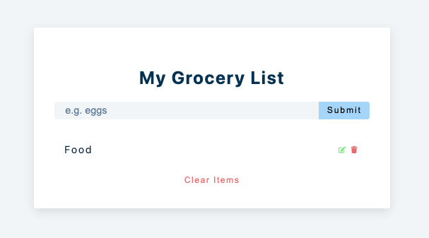
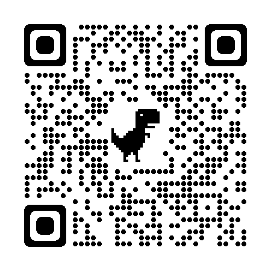

# My Grocery List: a React App

This project was bootstrapped with [Create React App](https://github.com/facebook/create-react-app).



### Github page Link below

[ 🛒 My Grocery List Project Link](https://jovyflagg.github.io/grocery-list/)

or scan qr code:



#### Credits:

#### React Icons

[react icons](https://react-icons.github.io/react-icons/)

```
npm install react-icons --save
```

```javascript
import { FaEdit } from 'react-icons/fa';

const Component = () => {
  return <FaHome className='icon'></FaHome>;
};
```

* John Smilga
* freeCodeCamp.org
* [15 React Projects](https://www.youtube.com/watch?v=a_7Z7C_JCyo&t=614s)
